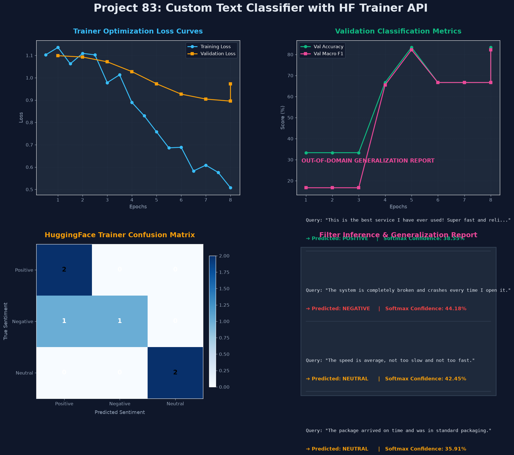

# Project 83: Custom Text Classifier with HuggingFace Trainer API

This repository implements a **Custom Multi-Class Sentiment Text Classifier** using PyTorch and the **Hugging Face Trainer API**. The system fine-tunes a pre-trained `distilbert-base-uncased` model on a custom sentiment dataset, using the high-level `Trainer` class to abstract the training loop, gradient accumulation, evaluation strategy, and metric computation.

---

## Technical and Mathematical Overview

### 1. Fine-Tuning with Cross-Entropy Loss

The classification head appends a softmax dense layer on top of the DistilBERT `[CLS]` token embedding. For a sample $x_i$ with true label $y_i \in \{0, 1, 2\}$ (Positive, Negative, Neutral), the fine-tuning objective is:

$$\mathcal{L} = -\frac{1}{N} \sum_{i=1}^{N} \log \frac{e^{z_{y_i}}}{\sum_{k=1}^{K} e^{z_k}}$$

where $z_k$ are the raw logit outputs of the classification head for class $k$ and $K=3$.

### 2. HuggingFace Trainer API Key Abstractions

The Trainer API wraps:
- **`TrainingArguments`**: Configures output directories, epochs, learning rate, evaluation strategy (`eval_strategy="epoch"`), batch sizes, warmup steps, and metric selection criteria.
- **`Trainer`**: Wraps the model, arguments, train/eval datasets, and a `compute_metrics` callback function.
- **`compute_metrics`**: Called after each epoch to compute accuracy, macro F1, macro precision, and macro recall from the model predictions.

### 3. Custom PyTorch Dataset

The custom `Dataset` subclass wraps tokenizer encodings and integer labels, returning a dictionary per sample that the Trainer's `DataCollatorWithPadding` batch-pads automatically:

```python
class CustomDataset(Dataset):
    def __init__(self, encodings, labels):
        self.encodings = encodings
        self.labels = labels

    def __getitem__(self, idx):
        item = {key: torch.tensor(val[idx]) for key, val in self.encodings.items()}
        item['labels'] = torch.tensor(self.labels[idx])
        return item
```

---

## Getting Started

### Prerequisites

```bash
pip install torch transformers accelerate scikit-learn matplotlib
```

> **Note**: The `accelerate` package is required by the PyTorch-based Trainer API.

### Running the Classifier

```bash
python main.py
```

---

## Results & Visual Dashboard

Upon execution, the script generates a performance dashboard saved as `trainer_classification_results.png`.



The dashboard presents four panels:
1. **Training & Validation Loss Curves**: Traces of train vs. evaluation losses over 8 epochs.
2. **Validation Metrics Curves**: Accuracy and macro F1 score progression.
3. **Validation Confusion Matrix**: Heatmap of true vs. predicted sentiment classes.
4. **Generalization Report Card**: Predicted sentiment labels and softmax confidence scores for unseen out-of-domain queries.

### Key Metrics
- **Validation Accuracy**: **83.33%** (5/6 correct classifications)
- **Macro F1**: **82.22%** | **Precision**: **88.89%** | **Recall**: **83.33%**
- Fine-tuning completed in **77.84 seconds** over 8 epochs
